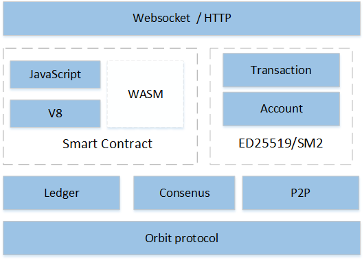

 
## __简介__
- __去中心化__ 
采用P2P分布式存储，没有中心化的管理节点，所有的节点具备相同的权利。

- __智能合约__ 
目前支持 JavaScript 语言，并由高效的 V8 引擎执行。并且后续将支持 WASM 虚拟机。

- __安全__ 
数据经过节点之间达成共识然后才可添加至区块链、共识节点的变更需用户投票处理。

- __高效__ 
通过优化数据结构、采用高效加密算法、关键路径多线程并发，使得性能提高明显，普通 PC 节点可以达万级别TPS。

- __稳定__
BUMO 区块链底层技术已经商用于数字资产平台一年多，目前（2018年4月7日）累积用户数1013万，周新增用户数14万，周新增交易数110万。

- __合规__
除了高效的 ED25519 签名算法，同时还支持 SM2/SM3 加密算法，

- __可移植__ 
使用标准C++开发，支持 Windows、Linux、MAC 等各种平台

## __架构__

## __使用说明__

参见[BUMO 区块链使用文档](docs/manual.md "") 

##  __开发文档__

参见[BUMO区块链开发文档](docs/develop.md "") 

## __License__
bubichain is under the GPLv3 license.
