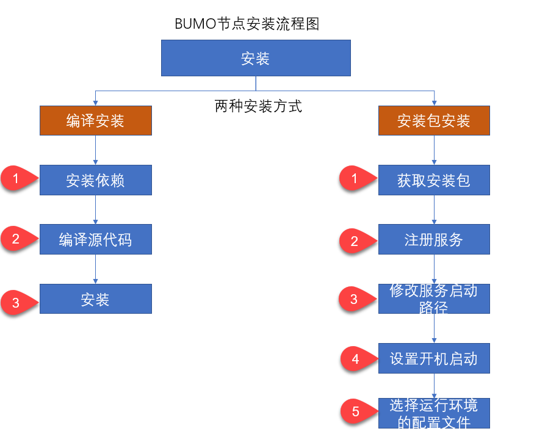
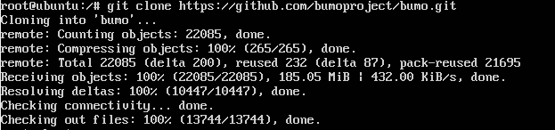
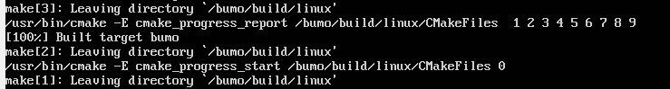
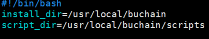
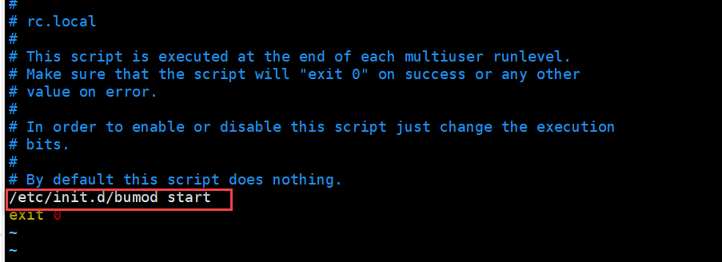
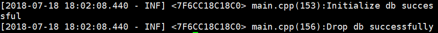
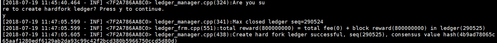

Installation Guide for BUMO
===========================

Overview
--------

This document will walk you through the process of installing and configuring the BUMO node in both Linux and MacOS systems.

System Requirements
-------------------

Before installing a BUMO node, you must make sure that your system meets the following conditions.

**Hardware Requirements**

The hardware requirements must meet the following configurations:

- **Recommended**：CPU 8 cores, memory 32G, bandwidth 20M, SSD disk 500G
- **Minimum**：CPU 4 cores, memory 16G, bandwidth 10M, SSD disk 500G

**Software Requirements**

You can choose Ubuntu, Centos or MacOS systems. The following systems are supported.

- Ubuntu 14.04
- Centos 7
- Mac OS X 10.11.4

Installing the BUMO Node in Linux
---------------------------------

The following installation example is based on Ubuntu 14.04.

Two installation methods are supported on Linux systems: `Installing by Compilation`_ and `Installing with a Package`_.

.. note:: |
   - The root directory in the root account is used as the installation directory in this installation document. You can choose your own installation directory
   - Before installing the BUMO node, you must make sure that the device's network connection is normal

Installing by Compilation
~~~~~~~~~~~~~~~~~~~~~~~~~

Installing by Compilation means that the source code of the BUMO node is first compiled into machine code that can be recognized by the computer and then installed. Installing by Compilation consists of three parts: `Installing Dependencies`_, `Compiling the BUMO Source Code`_, and `Installing the BUMO Node`_.

Installing Dependencies
^^^^^^^^^^^^^^^^^^^^^^^

You must install the dependencies required by the system before compiling the source code of the BUMO node. You must complete the following steps to install dependencies.

1. Input the following command to install ``automake``.

::

  sudo apt-get install automake

2. Input the following command to install ``autoconf``.

::

  sudo apt-get install autoconf

3. Input the following command to install ``libtool``.

::

  sudo apt-get install libtool

4. Input the following command to install ``g++``.

::

  sudo apt-get install g++

5. Input the following command to install ``libssl-dev``.

::
 
  sudo apt-get install libssl-dev

6. Input the following command to install ``cmake``.

:: 

  sudo apt-get install cmake

7. Input the following command to install ``libbz2-dev``.

::

  sudo apt-get install libbz2-dev

8. Input the following command to install ``python``.

::

  sudo apt-get install python

9. Input the following command to install ``unzip``.

:: 

  sudo apt-get install unzip

Compiling the BUMO Source Code
^^^^^^^^^^^^^^^^^^^^^^^^^^^^^^

The source code of BUMO can be compiled after the dependencies have been successfully installed. You must complete the following steps to compile the source code:

1. In the root directory, input the following command to download the source code file of BUMO. If ``git`` is not installed, you can install ``git`` with the ``sudo apt-get install git`` command.

::

  git clone https://github.com/bumoproject/bumo.git

|image1|

.. note:: The bumo/ directory will be created automatically during BUMO source code being downloaded, and the source code files will be stored in this directory.

2. Input the following command to enter the file directory of the source code.

::

  cd /bumo/build/

3. Input the following command to download the dependencies and initialize the development environment.

::
  
  ./install-build-deps-linux.sh

4. Input the following command to return to the bumo/ directory.

::

  cd ../

5. Input the following command to complete the compilation of the BUMO source code. The message below shows that the compilation is successful.

::
 
  make

|image2|

.. note:: The executable files generated after compilation are **bumo** and **bumod** which are stored in the /bumo/bin directory.

Installing the BUMO Node
^^^^^^^^^^^^^^^^^^^^^^^^

The BUMO node can be installed after the compilation is finished. You must complete the following steps to install a BUMO node:

1. Input the following command to enter the installation directory.

::

  cd /bumo/

2. Input the following command to complete the installation. The message below shows that the installation is successful.

::
  
  make install

|image3|

.. note:: | 
   - By default, the service is installed in the /usr/local/buchain/ directory.
   - After the installation is finished, you can start the bumo service with the ``service bumo start`` command without additional configuration.
   - After installing the BUMO node, the directory structure in the buchain/ directory is as follows:
   

+-----------------------------------+-----------------------------------+
| Directory                         | Description                       |
+===================================+===================================+
| bin                               | The directory stores the          |
|                                   | executable file (compiled bumo    |
|                                   | executable)                       |
+-----------------------------------+-----------------------------------+
| jslib                             | The directory stores the          |
|                                   | third-party ``js`` library        |
+-----------------------------------+-----------------------------------+
| config                            | The configuration file directory  |
|                                   | contains: bumo.json               |
+-----------------------------------+-----------------------------------+
| data                              | The database directory stores     |
|                                   | account ledger data               |
+-----------------------------------+-----------------------------------+
| scripts                           | The directory stores scripts to   |
|                                   | start and stop the node           |
+-----------------------------------+-----------------------------------+
| log                               | The directory stores logs.        |
|                                   | Available after bumo is started   |
+-----------------------------------+-----------------------------------+

Installing with a Package
~~~~~~~~~~~~~~~~~~~~~~~~~

Installing with a package refers to installing the BUMO node with an installation package. Installing the BUMO node with the installation package consists of five parts: `Obtaining the Installation Package and Extracting It`_, `Registering the Services`_, `Modifying the Service Startup Directory`_, `Setting the Boot Start`_, and `Selecting the Configuration File for the Running Environment`_.

Obtaining the Installation Package and Extracting It
^^^^^^^^^^^^^^^^^^^^^^^^^^^^^^^^^^^^^^^^^^^^^^^^^^^^^

You must complete the following steps to obtain the installation package of BUMO and extract it.

1. Input the following command to download the installation package of BUMO.

::

  wget https://github.com/bumoproject/bumo/releases/download/1.0.0.7/buchain-1.0.0.7-linux-x64.tar.gz

.. note:: |

   - If you don't have ``wget`` installed, you can use the ``apt-get install wget`` command to install ``wget``.
   - You can find the version you need from the https://github.com/bumoproject/bumo/releases link and then right-click the version to copy the download link.
   - In this example the file is downloaded to the root directory.

2. Copy the installation package to the /usr/local/ directory by inputting the following command.

::

  cp buchain-1.0.0.7-linux-x64.tar.gz /usr/local/

.. note:: The above copy operation is done in the directory where the file is downloaded. You must copy the file according to the specific download directory.

3. Input the following command to go to the /usr/local/ directory.

::

  cd /usr/local/

4. Input the following command to extract the file.

::

  tar -zxvf buchain-1.0.0.7-linux-x64.tar.gz

.. note:: After extracting the file, the buchain/ directory is generated.

Registering the Services
^^^^^^^^^^^^^^^^^^^^^^^^^

After extracting the file, you must register the services of bumo and bumod. You must complete the following steps to register services:

1. Input the following command to register the service of bumo.

::

  ln -s /usr/local/buchain/scripts/bumo /etc/init.d/bumo

2. Input the following command to register the service of bumod.

::
 
  ln -s /usr/local/buchain/scripts/bumod /etc/init.d/bumod

Modifying the Service Startup Directory
^^^^^^^^^^^^^^^^^^^^^^^^^^^^^^^^^^^^^^^

You must complete the following steps to modify the boot directory of bumo and bumod:

1. Open the bumo file by inputting the following command in the local/ directory.

::

  vim buchain/scripts/bumo

2. Locate ``install_dir`` and change the installation directory of bumo.

::

  install_dir=/usr/local/buchain

|image4|

.. note:: By default, the directory of ``install_dir`` is in the /usr/local/buchain directory; you can modify it according to the specific installation directory of bumo.

3. Press ``Esc`` to exit editing.

4. Input ``:wq`` to save the file.

5. Open the bumod file by inputting the following command in the local/ directory.

::

  vim /buchain/scripts/bumod

6. Locate ``install_dir`` and change the installation directory for bumod.

::

  install_dir=/usr/local/buchain

.. note:: By default, the directory of ``install_dir`` is in the /usr/local/buchain directory; you can modify it according to the specific installation directory of bumod.

7. Press ``Esc`` to exit editing.

8. Input ``:wq`` to save the file.

Setting the Boot Start
^^^^^^^^^^^^^^^^^^^^^^

Setting up booting includes setting the startup level, adding startup commands, and modifying file permissions. You must complete the following steps to set up the boot:

1. Input the following command to set level 1.

::
  
  ln -s -f /etc/init.d/bumod /etc/rc1.d/S99bumod

2. Input the following command to set level 2.

::
 
  ln -s -f /etc/init.d/bumod /etc/rc2.d/S99bumod
  
3. Input the following command to set level 3.

::

  ln -s -f /etc/init.d/bumod /etc/rc3.d/S99bumod

4. Input the following command to set level 4.

::
 
  ln -s -f /etc/init.d/bumod /etc/rc4.d/S99bumod

5. Input the following command to set level 5.

::
  
  ln -s -f /etc/init.d/bumod /etc/rc5.d/S99bumod

6. Input the following command to open the rc.local file.

::

  vim /etc/rc.local

7. Append the following command to the end of the rc.local file.

::

  /etc/init.d/bumod start

|image5|

8. Press ``Esc`` to exit editing.

9. Input ``:wq`` to save the file.

10. Execute the following command to set the permission of the rc.local file.

::
  
  chmod +x /etc/rc.local

.. note:: Now the BUMO node is installed. Before starting the bumo service, you must select the configuration file for the running environment.

Selecting the Configuration File for the Running Environment
^^^^^^^^^^^^^^^^^^^^^^^^^^^^^^^^^^^^^^^^^^^^^^^^^^^^^^^^^^^^

After installing the BUMO node, you must select the configuration file of the running environment to start the bumo service. You must complete the following steps to select the configuration file for the runtime environment:

1. Input the following command to go to the configuration file directory.

::
  
  cd /usr/local/buchain/config/

.. note:: | The configuration files for the following runtime environments are available in this directory.

  - bumo-mainnet.json：This file is the configuration file of the main network environment and is applied in the production environment
  - bumo-testnet.json：This file is the configuration file of the test network environment
  - bumo-single.json：This file is the configuration file for the single-node debugging environment

2. Input the following command to rename the configuration file for the runtime environment.

::

  mv bumo-testnet.json bumo.json

.. note:: |
   - In this example, the test network environment is selected as the running environment. You can also select other files as your running environment according to your needs.
   - After renaming the file, the bumo service can be started by the ``service start bumo`` command.
   - After installing the BUMO node, you can view the directory structure of the installation file in the buchain/ directory.

Installing the BUMO Node in MacOS
----------------------------------

Two installation methods are supported on MacOS systems: `Installing by Compilation in MacOS`_ and `Installing with a Package in MacOS`_.

Installing by Compilation in MacOS
~~~~~~~

Installing by Compilation means that the source code of the BUMO node is first compiled into machine code that can be recognized by the computer and then installed. Installing by Compilation consists of six parts: `Installing Xcode`_, `Installing Command Line Tools`_, `Installing Homebrew`_, `Installing Dependencies in MacOS`_, `Compiling the BUMO Source Code in MacOS`_, and `Installing the BUMO Node in MacOS <#installing-the-bumo-node-in-macos-1>`__.

Installing Xcode
^^^^^^^^^^^^^^^^

You must complete the following steps to install ``Xcode``:

1. Click `Software Download <https://idmsa.apple.com/IDMSWebAuth/login?appIdKey=891bd3417a7776362562d2197f89480a8547b108fd934911bcbea0110d07f757&path=%2Fdownload%2Fmore%2F&rv=1>`_.
2. Input ``Apple ID`` and ``Password``.
3. Click ``Sign in`` to go to the download page. 
4. Click ``Xcode 9.4.1`` to start downloading ``Xcode``.
5. Unzip the ``Xcode_9.4.1.xip`` file.
6. Double-click the extracted file ``Xcode`` to complete the installation.

.. note:: When choosing the version of ``Xcode``, you must select one which is suitable to your MacOS system.

Installing Command Line Tools
^^^^^^^^^^^^^^^^^^^^^^^^^^^^^

You must complete the following steps to install ``Command Line Tools``:

1. Click `Software Download <https://idmsa.apple.com/IDMSWebAuth/login?appIdKey=891bd3417a7776362562d2197f89480a8547b108fd934911bcbea0110d07f757&path=%2Fdownload%2Fmore%2F&rv=1>`_ .
2. Input ``Apple ID`` and ``Password``.
3. Click ``Sign in`` to go to the download page.  
4. Click ``Command Line Tools(macOS 10.14)for Xcode 10 Beta 6`` to start downloading ``Command Line Tools``.
5. Double-click ``Command_Line_Tools_macOS_10.14_for_Xcode_10Beta_6.dmg``.
6. Click the ``Command Line Tools`` icon.
7. Click **Next**
8. Select a language and then click **Next**.
9. Click **Agree**.
10. Click **Install**.
11. Input password for you mac and then click **Install software**.

.. note::  When choosing the version of ``Command Line Tools``, you must select one which is suitable to your MacOS system.

Installing Homebrew
^^^^^^^^^^^^^^^^^^^

You must complete following steps to install Homebrew:

1. Open the terminal in the MacOS system.
2. Input the following code in the terminal:

::
 
 /usr/bin/ruby -e "$(curl -fsSL https://raw.githubusercontent.com/Homebrew/install/master/install)"

3. Press ``Enter`` to install.

Installing Dependencies in MacOS
^^^^^^^^^^^^^^^^^^^^^^^^^^^^^^^^

1. Input the following command to set ``Homebrew`` without automatic update.

::

  export HOMEBREW_NO_AUTO_UPDATE=true

2. Input the following command to install ``autoconf``.

::

  brew install autoconf

3. Input the following command to install ``automake``.

::

   brew install automake

4. Input the following command to install ``libtool``.

::

  brew install libtool

5. Input the following command to install ``cmake``.

::
  
  brew install cmake

6. Input the following command to install ``python``.

::
  
  brew install python

7. Input the following command to install ``m4``.

::

  brew install m4

8. Input the following command to install ``wget``.

::
  
  brew install wget

Compiling the BUMO Source Code in MacOS
^^^^^^^^^^^^^^^^^^^^^^^^^^^^^^^^^^^^^^^
1. In the root directory, input the following command to download the source code file of BUMO. If ``git`` is not installed, you can install ``git`` with the ``sudo apt-get install git`` command. 

::
  
  sudo git clone https://github.com/bumoproject/bumo.git

|image1|

.. note:: The bumo/ directory will be created automatically during the BUMO source code being downloaded, and the source code file will be stored in this directory.

2. Input the following command to go to the file directory of the source code. 

::
  
  cd /bumo/build/

3. Input the following command to download the dependencies and initialize the development environment.

::
  
  sudo ./install-build-deps-mac.sh

4. Input the following command to return to the bumo/ directory.

::

  cd ../

5. Input the following command to complete the compilation of the BUMO source code.

::
 
  sudo make

.. note::  The executable files generated after compilation are **bumo** and **bumod** which are stored in the /bumo/bin directory.

.. _Installing the BUMO Node in MacOS-1:

Installing the BUMO Node in MacOS
^^^^^^^^^^^^^^^^^^^^^^^^^^^^^^^^^^

The BUMO node can be installed after the compilation is finished. You must complete the following steps to install a BUMO node:

1. Input the following command to go to the installation directory.

::

  cd /bumo/

2.Input the following command to complete the installation.

::
  
  sudo make install

.. note:: | 
   - By default, the service is installed in the /usr/local/buchain/ directory.
   - After installing the BUMO node, the directory structure in the buchain/ directory is as follows:

+-----------------------------------+-----------------------------------+
| Directory                         | Description                       |
+===================================+===================================+
| bin                               | The directory stores the          |
|                                   | executable file (compiled bumo    |
|                                   | executable)                       |
+-----------------------------------+-----------------------------------+
| jslib                             | The directory stores the          |
|                                   | third-party ``js`` library        |
+-----------------------------------+-----------------------------------+
| config                            | The configuration file directory  |
|                                   | contains: bumo.json               |
+-----------------------------------+-----------------------------------+
| data                              | The database directory stores     |
|                                   | account ledger data               |
+-----------------------------------+-----------------------------------+
| log                               | The directory stores logs.        |
|                                   | Available after bumo is started   |
+-----------------------------------+-----------------------------------+

Installing with a Package in MacOS
~~~~~~~~~~~~~~~~~~~~~~~~~~~~~~~~~~

Installing with a Package refers to installing the BUMO node with an installation package. Installing the BUMO node as an installation package consists of two parts: `Obtaining the Installation Package and Extracting It in MacOS`_, and
`Selecting the Configuration File for the Running Environment in MacOS`_.

Obtaining the Installation Package and Extracting It in MacOS
^^^^^^^^^^^^^^^^^^^^^^^^^^^^^^^^^^^^^^^^^^^^^^^^^^^^^^^^^^^^^

1. Download the required installation package from the address below.

::

  sudo wget https://github.com/bumoproject/bumo/releases/download/1.0.0.7/buchain-1.0.0.7-macOS-x64.tar.gz

.. note:: |

   - If you don't have ``wget`` installed, you can use the ``apt-get install wget`` command to install ``wget``.
   - You can find the version you need from the https://github.com/bumoproject/bumo/releases link and then right-click the version to copy the download link.
   - In this example the file is downloaded to the root directory.

2. Copy the installation package to the /usr/local/ directory by inputting the following command.

::

  sudo cp buchain-1.0.0.7-macOS-x64.tar.gz /usr/local/

.. note:: The above copy operation is done in the directory where the file is downloaded. You must copy the file according to the specific download directory.

3. Input the following command to go to the /usr/local/ directory.

::

  cd /usr/local/

4. Input the following command to extract the file.

::

  sudo tar -zxvf buchain-1.0.0.7-macOS-x64.tar.gz

.. note:: After extracting the file, the buchain/ directory is generated.

+-----------------------------------+-----------------------------------+
| Directory                         | Description                       |
+===================================+===================================+
| bin                               | The directory stores the          |
|                                   | executable file (compiled bumo    |
|                                   | executable)                       |
+-----------------------------------+-----------------------------------+
| jslib                             | The directory stores the          |
|                                   | third-party ``js`` library        |
+-----------------------------------+-----------------------------------+
| config                            | The configuration file directory  |
|                                   | contains: bumo.json               |
+-----------------------------------+-----------------------------------+
| data                              | The database directory stores     |
|                                   | account ledger data               |
+-----------------------------------+-----------------------------------+
| log                               | The directory stores logs.        |
|                                   | Available after bumo is started   |
+-----------------------------------+-----------------------------------+

Selecting the Configuration File for the Running Environment in MacOS
^^^^^^^^^^^^^^^^^^^^^^^^^^^^^^^^^^^^^^^^^^^^^^^^^^^^^^^^^^^^^^^^^^^^^

After installing the BUMO node, you must select the configuration file of the running environment to start the bumo service. You must complete the following steps to select the configuration file for the runtime environment:

1. Input the following command to go to the configuration file directory.

::
  
  cd /usr/local/buchain/config/

.. note:: | The configuration files for the following runtime environments are available in this directory.

  - bumo-mainnet.json：This file is the configuration file of the main network environment and is applied in the production environment
  - bumo-testnet.json：This file is the configuration file of the test network environment
  - bumo-single.json：This file is the configuration file for the single-node debugging environment

2. Input the following command to rename the configuration file for the runtime environment.

::

  mv bumo-testnet.json bumo.json

.. note:: |
   - In this example, the test network environment is selected as the running environment. You can also select other files as your running environment according to your needs.
   - After renaming the file, the bumo service can be started by the ``service start bumo`` command.
   - After installing the BUMO node, you can view the directory structure of the installation file in the buchain/ directory.

Configuration
-------------

The configuration is divided into `General Configuration`_ and `Multi-Node Configuration Example`_.

General Configuration
~~~~~~~~~~~~~~~~~~~~~

General configuration includes data storage, communication between nodes, WEB API, WebSocket API, blocks, genesis, and log. The general configuration is configured in the bumo.json file in the /usr/local/buchain/config directory.

**Data Storage**

::
 
   "db":{
   "account_path": "data/account.db", //Store account data
   "ledger_path": "data/ledger.db", //Store block data
   "keyvalue_path": "data/keyvalue.db" //Store consensus data
   }

**Communication between Nodes**

::

   "p2p":
   {
   "network_id":30000,//Network ID
   //Consensus network
   "consensus_network":
   {
   "heartbeat_interval":60, //Heartbeat cycle, in second
   "listen_port":36001,//Port monitored
   "target_peer_connection":50, //Maximum number of active connections
   "known_peers":
   [
   "127.0.0.1:36001"//Connect to other nodes
   ]
   }
   }

**WEB API Configuration**

::

   "webserver":{
   "listen_addresses":"0.0.0.0:16002"
   }

**WebSocket API Configuration**

::

   "wsserver":
   {
   "listen_address":"0.0.0.0:36003"
   }

**Block Configuration** 

::

   "ledger":
   {
   "validation_address":"buQmtDED9nFcCfRkwAF4TVhg6SL1FupDNhZY",//The address of validation node; the sync node or wallet does not need to be configured
   "validation_private_key": "e174929ecec818c0861aeb168ebb800f6317dae1d439ec85ac0ce4ccdb88487487c3b74a316ee777a3a7a77e5b12efd724cd789b3b57b063b5db0215fc8f3e89", //The private key of validation node; the sync node or wallet does not need to be configured
   "max_trans_per_ledger":1000, //Maximum number of transactions per block
   "tx_pool": //Transaction pool configuration
   {
   "queue_limit":10240, // Limited transactions in the transaction pool
   "queue_per_account_txs_limit":64 //Maximum transaction buffer for a single account
   }
   }

.. note:: ``Validation_address`` and ``validation_private_key`` can be obtained through the bumo program command line tool. Please save the account information properly and you will not be able to retrieve it if it is lost.

::

   [root@bumo ~]# cd /usr/local/buchain/bin
   [root@bumo bin]#./bumo --create-account

   {
   "address" : "buQmtDED9nFcCfRkwAF4TVhg6SL1FupDNhZY", //Address
   "private_key" : "privbsZozNs3q9aixZWEUzL9ft8AYph5DixN1sQccYvLs2zPsPhPK1Pt", //Private key
   "private_key_aes" : "e174929ecec818c0861aeb168ebb800f6317dae1d439ec85ac0ce4ccdb88487487c3b74a316ee777a3a7a77e5b12efd724cd789b3b57b063b5db0215fc8f3e89", //AES encrypted private key
   "public_key" : "b00108d329d5ff69a70177a60bf1b68972576b35a22d99d0b9a61541ab568521db5ee817fea6", //Public key
   "public_key_raw" : "08d329d5ff69a70177a60bf1b68972576b35a22d99d0b9a61541ab568521db5e", //Original public key
   "sign_type" : "ed25519" //ed25519 encrypted
   }

**Genesis**

::

   "genesis":
   {
   "account": "buQs9npaCq9mNFZG18qu88ZcmXYqd6bqpTU3", //Genesis address
   "slogan" : "a new era of value", //Slogan stored in genesis
   "fees":
   {
   "base_reserve": 10000000, //Base reserve for the account
   "gas_price": 1000 //Byte fee
   },
   "validators": ["buQBwe7LZYCYHfxiEGb1RE9XC9kN2qrGXWCY"] //The block list of validation node
   }

.. note:: The ``genesis`` configuration on the same blockchain must be consistent. ``account`` can be obtained by the bumo program command line tool ``./bumo --create-account``. Please save the account information properly and you will not be able to retrieve it if it is lost.

**Log Configuration**

::

   "logger":
   {
   "path":"log/buchain.log", // Log directory
   "dest":"FILE|STDOUT|STDERR", //Output file classification
   "level":"TRACE|INFO|WARNING|ERROR|FATAL",//Log level
   "time_capacity":1, //Time span, day
   "size_capacity":10, //Capacity, Megabyte
   "expire_days":10 //Cycle of cleaning up the log, day
   }

Multi-Node Configuration Example
~~~~~~~~~~~~~~~~~~~~~~~~~~~~~~~~

In this section, two verification nodes and one synchronization node are taken as examples to describe the configuration of multiple nodes in the same blockchain. The three modules p2p, ledger and genesis need to be modified.

**Configuration of p2p Module**

The ``known_peers`` of p2p must be the IP and port of other known nodes for the interconnection between nodes.

::

   verification node one:
   "p2p":
   {
   "network_id":30000,
   "consensus_network":
   {
   "heartbeat_interval":60,
   "listen_port":36001,
   "target_peer_connection":50,
   "known_peers":
   [
   "192.168.1.102:36001", //IP and port of node two
   "192.168.1.103:36001" //IP and port of node three
   ]
   }
   }

   verification node two:
   "p2p":
   {
   "network_id":30000,
   "consensus_network":
   {
   "heartbeat_interval":60,
   "listen_port":36001,
   "target_peer_connection":50,
   "known_peers":
   [
   "192.168.1.101:36001", //IP and port of node one
   "192.168.1.103:36001" //IP and port of node three 
   ]
   }
   }

   synchronization node three:
   "p2p":
   {
   "network_id":30000,
   "consensus_network":
   {
   "heartbeat_interval":60,
   "listen_port":36001,
   "target_peer_connection":50,
   "known_peers":
   [
   "192.168.1.101:36001", //IP and port of node one
   "192.168.1.102:36001" //IP and port of node two
   ]
   }
   }

**Configuration of Leger Module**

The ``validation_address`` and ``validation_private_key`` from the ledger of verification node must match. And you must input ``validation_address`` of all the verification nodes into ``genesis.validators``.

::

   Verification node one:
   "ledger":
   {
   "validation_address":"buQBwe7LZYCYHfxiEGb1RE9XC9kN2qrGXWCY",//The address of verification node one; the sync node or wallet does not need to be configured
   "validation_private_key": "66932f19d5be465ea9e7cfcb3ea7326d81953b9f99bc39ddb437b5367937f234b866695e1aae9be4bae27317c9987f80be882ae3d2535d4586deb3645ecd7e54", //The private key of verification node two; the synchronization node or wallet does not need to be configured
   "max_trans_per_ledger":1000,
   "tx_pool":
   {
   "queue_limit":10240,
   "queue_per_account_txs_limit":64
   }
   }

   Verification node two:
   "ledger":
   {
   "validation_address":"buQqkp5SDcsxpwWXQ2QFQbvHKnZ199HY3dHm",//The address of verification node two; the sync node or wallet does not need to be configured
   "validation_private_key": "1cb0151ec2b23cb97bf94d86ee1100582f9f5fbfdfe40a69edae2d2b8711395c40c1da859ac0bc93240a8a70c4a06779ed06d299880417d71fc51c1a0267875f", //The private key of verification node two; the synchronization node or wallet does not need to be configured
   "max_trans_per_ledger":1000,
   "tx_pool":
   {
   "queue_limit":10240,
   "queue_per_account_txs_limit":64
   }
   }

   Verification node three:
   "ledger":
   {
   "max_trans_per_ledger":1000,
   "tx_pool":
   {
   "queue_limit":10240,
   "queue_per_account_txs_limit":64
   }
   }

**Configuration of Genesis Module**

The genesis configuration on the same blockchain must be consistent.

::

   Verification note one:
   "genesis":
   {
   "account": "buQs9npaCq9mNFZG18qu88ZcmXYqd6bqpTU3",
   "slogan" : "a new era of value",
   "fees":
   {
   "base_reserve": 10000000,
   "gas_price": 1000
   },
   "validators": ["buQBwe7LZYCYHfxiEGb1RE9XC9kN2qrGXWCY", "buQqkp5SDcsxpwWXQ2QFQbvHKnZ199HY3dHm"] //All verification node addresses need to be configured. If there are two verification nodes, configure two addresses.
   }

   Verification note two:
   "genesis":
   {
   "account": "buQs9npaCq9mNFZG18qu88ZcmXYqd6bqpTU3",
   "slogan" : "a new era of value",
   "fees":
   {
   "base_reserve": 10000000,
   "gas_price": 1000
   },
   "validators": ["buQBwe7LZYCYHfxiEGb1RE9XC9kN2qrGXWCY", "buQqkp5SDcsxpwWXQ2QFQbvHKnZ199HY3dHm"] //All verification node addresses need to be configured. If there are two verification nodes, configure two addresses.
   }

   Verification note three:
   "genesis":
   {
   "account": "buQs9npaCq9mNFZG18qu88ZcmXYqd6bqpTU3",
   "slogan" : "a new era of value",
   "fees":
   {
   "base_reserve": 10000000,
   "gas_price": 1000
   },
   "validators": ["buQBwe7LZYCYHfxiEGb1RE9XC9kN2qrGXWCY", "buQqkp5SDcsxpwWXQ2QFQbvHKnZ199HY3dHm"] //All verification node addresses need to be configured. If there are two verification nodes, configure two addresses.
   }

.. note:: |
   - Before running, please make sure that the initial data of each node is consistent, otherwise you will not be able to reach consensus to generate the block.
   - ``account``, ``validation_address`` can be obtained by the bumo program command line tool ``./bumo --create-account``. Please save the account information properly and you will not be able to retrieve it if it is lost.

Maintenance Service
-------------------

In the maintenance service, the BUMO service operations such as startup, shutdown, status query, system details query, clear database, create a hard fork, and change the running environment, are described in detail.

**Starting the BUMO Service**

Input the following command to start the bumo service.

::

   service bumo start

.. note:: To start the bumo service in MacOS, you must enter the /usr/local/buchain/bin directory and start the bumo service with the ``./bumo`` command.

**Stopping the BUMO Service**

Input the following command to stop the bumo service.

::

   service bumo stop

.. note:: In the MacOS system, you can stop the bumo service by pressing ``control+c``.

**Querying the BUMO Service Status**

Input the following command to query the bumo service.

::

   service bumo status

.. note:: No service is available in MacOS.

**Querying the Detailed System Status**

Input the following command to query the detailed system status.

::

   curl 127.0.0.1:19333/getModulesStatus

The result is shown below:

::

   {
    "glue_manager":{
        "cache_topic_size":0,
        "ledger_upgrade":{
            "current_states":null,
            "local_state":null
        },
        "system":{
            "current_time":"2017-07-20 10:32:22", //Current system time
            "process_uptime":"2017-07-20 09:35:06", //When bumo is started
            "uptime":"2017-05-14 23:51:04"
        },
        "time":"0 ms",
        "transaction_size":0
    },
    "keyvalue_db":Object{...},
    "ledger_db":Object{...},
    "ledger_manager":{
        "account_count":2316,  //Total accounts
        "hash_type":"sha256",
        "ledger_sequence":12187,
        "time":"0 ms",
        "tx_count":1185   //Total transactions
    },
    "peer_manager":Object{...},
    "web server":Object{...},

.. note:: No service is available in MacOS.

**Clearing Database**

You must stop the BUMO service before clearing the database. You must complete the following steps to clear the database:

1. Input the following command to enter the bumo service directory.

::

   cd /usr/local/buchain/bin

2. Input the following command to clear the database.

::

   ./bumo --dropdb

.. note:: After the database is successfully cleared, you can see the information shown below.

|image6|

**Creating a Hard Fork**

You must complete the following steps to create a hard fork.

1. Create the hard fork by inputting the following command in the /usr/local directory.

::

  buchain/bin/bumo --create-hardfork

2. Enter ``y`` when prompted and then press ``Enter``. The message shown below indicates the hard fork is created successfully.

|image7|

.. note:: |
   - After executing the above command, the new blockchain network has only one verification node.
   - After executing the hard fork command, the following hash value is displayed:

::

  4b9ad78065c65aaf1280edf6129ab2da93c99c42f2bcd380b5966750ccd5d80d

3. Input the following command to clear the consensus status data. When clearing the consensus status data, you must ensure that the bumo service is not running, otherwise it cannot be cleared.

::
  
  buchain/bin/bumo --clear-consensus-status

4. Add the hash value to the bumo.json file in the /usr/local/buchain/config directory of the node or synchronization node.

::

  "ledger": {
  "genesis_account": "buQs9npaCq9mNFZG18qu88ZcmXYqd6bqpTU3",
  "max_trans_per_ledger": 1000,
  "hardfork_points" :
  [
  "4b9ad78065c65aaf1280edf6129ab2da93c99c42f2bcd380b5966750ccd5d80d
  "
  ]
  },

5. Start the node service for the configuration to take effect.

**Changing the Running Environment**

Before changing the running environment, you must make sure that the BUMO service is down. If you want to change the running environment of the BUMO node, you can modify it by following the steps below.

1. Input the following command to enter the directory where the configuration file is located.

::

  cd /usr/local/buchain/config/

.. note:: | The configuration files for the following runtime environments are available in this directory.

  - bumo-mainnet.json：This file is the configuration file of the main network environment and is applied in the production environment
  - bumo-testnet.json：This file is the configuration file of the test network environment
  - bumo-single.json：This file is the configuration file for the single-node debugging environment

2. Change the configuration file name (bumo.json) for the current running environment, for example:

::
  
  mv bumo.json bumoprevious.json

3. Change the environment configuration file to run to bumo.json, for example:

::
  
  mv bumo-mainnet.json bumo.json

.. note:: | 
   - In this example, the main network environment is set to the running environment.
   - After changing the running environment, you must clear the database to restart the bumo service.

Uninstalling the BUMO Node
--------------------------

Uninstalling BUMO nodes is divided into two categories, one for uninstalling the BUMO node installed by compilation and the other is for uninstalling the BUMO node installed with a package.

Uninstalling the BUMO Node Installed by Compilation
~~~~~~~~~~~~~~~~~~~~~~~~~~~~~~~~~~~~~~~~~~~~~~~~~~~~~~

If you installed the BUMO node by compilation, you can uninstall the BUMO node by the following steps:

1. Input the following command to enter the BUMO installation directory.

::
  
  cd /bumo

2. Input the following command to delete the BUMO node.

:: 
  
  make uninstall

.. note:: Now the BUMO node is uninstalled.

 
Uninstalling the BUMO Node Installed with a Package
~~~~~~~~~~~~~~~~~~~~~~~~~~~~~~~~~~~~~~~~~~~~~~~~~~~

If you installed the BUMO node with the installation package, you can uninstall the BUMO node by the following steps:

1. Input the following command to delete the directory of the buchain.

::

  sudo rm -rf /usr/local/buchain/

2. Input the following command to delete the soft link of bumo.

::

  sudo rm -rf /etc/init.d/bumo

3. Input the following command to delete the soft link of bumod.

::

  sudo rm -rf /etc/init.d/bumod

.. note:: Now the BUMO node is uninstalled.

